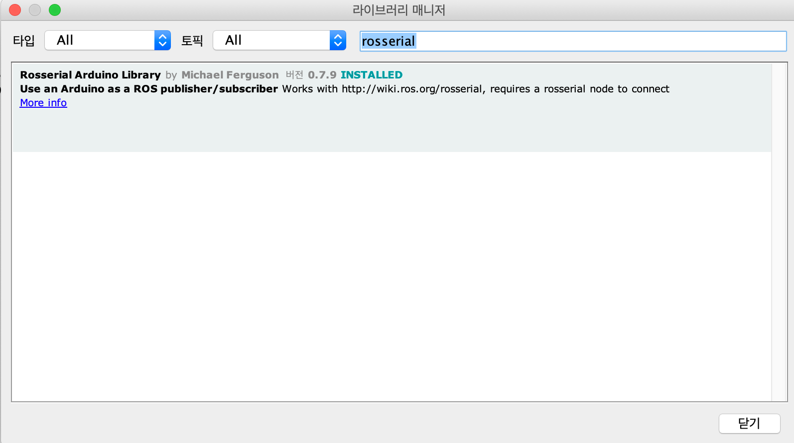

# iTurtle : Turtlebot for students
- 학생들의 ROS 스터디를 위한 미니 로봇 제작 프로젝트로, 학생 및 관심있는 여러분들의 참여로 만들어지고 있습니다. 언제라도 참여를 환영합니다.

* [Slack / Chat](http://bit.ly/오로카판교슬랙)

## 아래와 같이 활용이 가능합니다.
- 라이더를 이용한 자율주행 자동차
- 음성인식 기능을 이용한 챗봇
- ROS 이해를 위한 로봇 

## OpenCrArduino
- OpenCr보드와 동일하지만, 아두이노 보드 베이스의 커스텀 제작 보드 콘트롤 예제
- 기본적으로는 아래의 소스를 기본으로 한다.
https://www.arduinolibraries.info/libraries/rosserial-arduino-library
https://github.com/frankjoshua/rosserial_arduino_lib
- 만약 커스텀 보드를 사용하지 않고, 일반 아두이노 보드를 사용하려면, 아래의 라이브러리를 먼저 인스톨 해야 한다.

# First-Time Git Setup in MS Code
$ git config --global user.name "John Doe"
$ git config --global user.email johndoe@example.com
